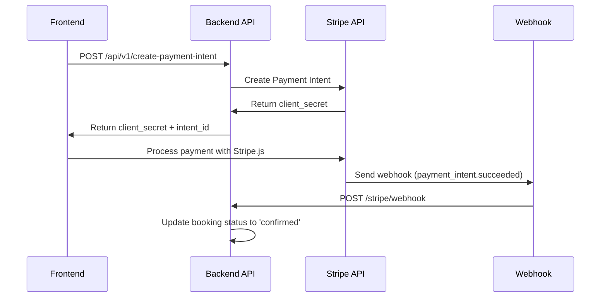

# 💳 Stripe Payment Integration Setup

## Overview

This implementation provides secure payment processing for FiveStars booking confirmations using Stripe's Payment Intents API with webhook-based payment confirmation.

## 🏗️ Architecture



## 🚀 Quick Setup

### 1. Install Dependencies

```bash
composer require stripe/stripe-php
```

### 2. Environment Configuration

Add to your `.env` file:

```env
# Stripe Configuration
STRIPE_KEY=pk_test_your_publishable_key_here
STRIPE_SECRET=sk_test_your_secret_key_here
STRIPE_WEBHOOK_SECRET=whsec_your_webhook_endpoint_secret_here
```

### 3. Run Database Migration

```bash
php artisan migrate
```

This adds payment fields to the `bookings` table:
- `stripe_payment_intent_id`
- `stripe_charge_id` 
- `payment_status` (pending, paid, failed, canceled, refunded)
- `payment_date`
- `payment_failure_reason`

## 📡 API Endpoints

### Create Payment Intent

```http
POST /api/v1/create-payment-intent
Content-Type: application/json

{
  "booking_id": "123",
  "currency": "USD"
}
```

**Response:**
```json
{
  "success": true,
  "data": {
    "client_secret": "pi_xxx_secret_xxx",
    "payment_intent_id": "pi_xxx",
    "amount": 15000,
    "currency": "usd",
    "booking": { /* booking details */ }
  }
}
```

### Get Payment Status

```http
GET /api/v1/bookings/{id}/payment-status
```

**Response:**
```json
{
  "success": true,
  "data": {
    "booking_id": "123",
    "payment_status": "paid",
    "payment_intent_id": "pi_xxx",
    "payment_date": "2025-09-06T18:30:00.000000Z",
    "stripe_status": "succeeded"
  }
}
```

### Stripe Webhook

```http
POST /stripe/webhook
Content-Type: application/json
Stripe-Signature: t=timestamp,v1=signature

{
  "type": "payment_intent.succeeded",
  "data": {
    "object": {
      "id": "pi_xxx",
      "metadata": {
        "booking_id": "123"
      }
    }
  }
}
```

## 🔐 Security Features

### 1. **Backend-Only Secret Keys**
- Stripe secret keys never exposed to frontend
- Payment intents created server-side only

### 2. **Webhook Signature Verification**
- All webhooks verified using Stripe signing secret
- Prevents malicious webhook calls

### 3. **Idempotency**
- Reuses existing payment intents when possible
- Prevents duplicate charges

### 4. **Input Validation**
- All payment requests validated
- Supported currencies: USD, EUR, GBP, MXN, CAD

## 🎯 Frontend Integration

### Using Stripe.js (React Example)

```javascript
// 1. Create payment intent
const response = await fetch('/api/v1/create-payment-intent', {
  method: 'POST',
  headers: { 'Content-Type': 'application/json' },
  body: JSON.stringify({ 
    booking_id: bookingId,
    currency: 'USD' 
  })
});

const { client_secret } = await response.json();

// 2. Process payment with Stripe Elements
const { error } = await stripe.confirmCardPayment(client_secret, {
  payment_method: {
    card: cardElement,
    billing_details: { name: customerName }
  }
});

if (!error) {
  // Payment succeeded! 
  // Webhook will automatically confirm the booking
  console.log('Payment successful!');
}
```

## 🔔 Webhook Events Handled

| Event | Action |
|-------|--------|
| `payment_intent.succeeded` | Confirm booking, set status to 'confirmed' |
| `payment_intent.payment_failed` | Set payment_status to 'failed' |
| `payment_intent.canceled` | Set payment_status to 'canceled' |

## 🧪 Testing

### Test Cards

Use Stripe test cards for development:

```
4242424242424242 - Visa (succeeds)
4000000000000002 - Visa (card declined)
4000002500003155 - Visa (requires authentication)
```

### Webhook Testing

1. Install Stripe CLI:
```bash
stripe listen --forward-to localhost:8000/stripe/webhook
```

2. Trigger test events:
```bash
stripe trigger payment_intent.succeeded
```

## 📊 Monitoring & Logging

All payment operations are logged with context:

```php
Log::info('Payment intent created', [
    'booking_id' => $booking->id,
    'payment_intent_id' => $paymentIntent->id,
    'amount' => $amount,
    'currency' => $currency
]);
```

## 🎛️ Configuration Options

### Supported Currencies
- USD (US Dollar)
- EUR (Euro) 
- GBP (British Pound)
- MXN (Mexican Peso)
- CAD (Canadian Dollar)

### Payment Methods
- Credit/Debit Cards (Visa, Mastercard, Amex)
- Additional methods can be enabled in Stripe dashboard

## 🚨 Error Handling

### Common Error Responses

```json
{
  "success": false,
  "message": "Booking is not available for payment",
  "error_code": 422
}
```

### Error Codes
- `422` - Validation error (invalid booking/currency)
- `500` - Stripe API error or server error
- `400` - Invalid webhook signature
- `404` - Booking not found

## 🔄 Payment Flow States

```
Booking Created (pending) 
    ↓
Payment Intent Created (payment_status: pending)
    ↓  
Customer Completes Payment
    ↓
Webhook Received (payment_intent.succeeded)
    ↓
Booking Confirmed (status: confirmed, payment_status: paid)
```

## 📋 Postman Collection

The project includes comprehensive Postman tests:
- ✅ Create payment intents
- ✅ Multiple currency support  
- ✅ Payment status checking
- ✅ Webhook simulation
- ✅ Error case testing

Import the collection from: `postman/FiveStars-Complete-API-Test-Suite.postman_collection.json`

---

## 🛠️ Troubleshooting

### Payment Intent Creation Fails
1. Check Stripe API keys in `.env`
2. Verify booking exists and status is 'pending'
3. Check Laravel logs for Stripe API errors

### Webhooks Not Working
1. Verify webhook endpoint secret matches Stripe dashboard
2. Check webhook signature verification
3. Ensure webhook URL is accessible (use ngrok for local testing)

### Frontend Payment Fails
1. Verify client_secret is valid
2. Check browser console for Stripe.js errors  
3. Test with Stripe test cards

For production deployment, remember to:
- Use live Stripe keys
- Set up proper SSL/HTTPS
- Configure webhook endpoints in Stripe dashboard
- Set up monitoring and alerts